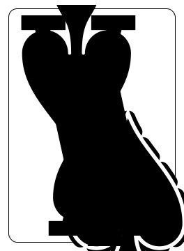
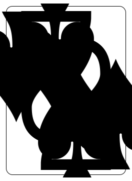
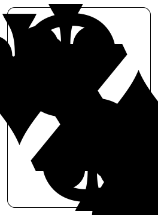
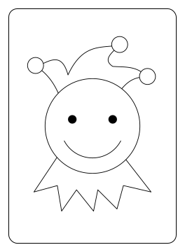
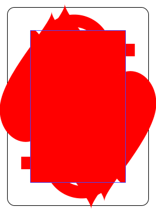
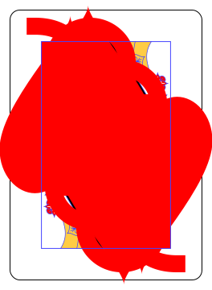
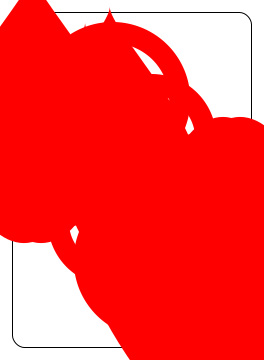
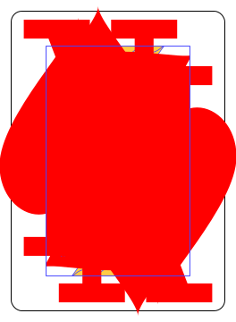

[](https://github.com/peter-mghendi/karata/actions/workflows/test-solution.yml)
[](https://github.com/peter-mghendi/karata/actions/workflows/publish-server.yml)
[](https://github.com/peter-mghendi/karata/actions/workflows/publish-web.yml)
[](https://app.netlify.com/projects/karata/deploys)

# karata

> Karata (cards) is a Swahili word that refers to both the Kenyan game of cards and the cards used to play it.

Real-time Kenyan street poker over ASP.NET Core SignalR/websockets.

The game is currently playable and implements all game logic.

There is also a custom cards library [here](https://github.com/sixpeteunder/karata/tree/main/src/Karata.Cards) (with a complete test suite).

## Features
- [x] Real-time in-game chat.
- [x] Real-time gameplay.
- [x] Game logic.
- [x] Activity Feed
- [x] Password-protected rooms.
- [x] Player disconnection/reconnection handling.
- [x] Resumable games.
- [ ] Configurable rules.
- [x] Game replays.
- [ ] Friend system.
- [ ] Tournaments/Knockouts.
- [ ] Fines for illegal moves.
- [x] Bots

## Installation

### Karata.Server

"Karata.Server" is the supported server runtime.

#### Docker (recommended)

The latest server image is published to GitHub Container Registry:

Pull

```shell
docker pull ghcr.io/peter-mghendi/karata-server:latest
```

Run:

```shell
docker run -d \
  --name karata-server \
  --env-file path/to/your/.env \
  -p 5000:5000 \
  ghcr.io/peter-mghendi/karata-server:latest
```

A PostgreSQL-compatible database is required.

#### Pre-built binary

Pre-built server binaries are attached to GitHub Releases.

Builds are currently available for:

- `linux-x64`

```
chmod +x karata-server-linux-x64
source path/to/your/.env ./karata-server-linux-x64
```

The server expects its configuration to be supplied via environment variables.

#### Building from source

Build from source:

```shell
git clone https://github.com/peter-mghendi/karata.git
cd karata

dotnet publish src/Karata.Server -c Release
```

---

### Karata.Web

"Karata.Web" is the browser client.

#### Release Artifact

Compiled frontend assets are attached to GitHub Releases as `karata-web.tar.gz`.

Extract the archive and serve the resulting files using any static web server.

```shell
tar -xzf karata-web.tar.gz
```

#### Published Assets Branch

The latest generated frontend assets are also available in the `releases-karata-web` branch.

This branch contains build output only and may be used directly with static hosting providers.

#### Building from source

Build from source:

```shell
git clone https://github.com/sixpeteunder/karata.git
cd karata

dotnet publish src/Karata.Web -c Release
```

---

## Rules

> The rules are automatically applied to games, you do not need to actively think about them (unless fines are enabled!)
> This is mostly included for reference and troubleshooting the game's behaviour.
> I should probably add these to an in-game "rules" page.

None of the sources I consulted could agree on a canonical set of rules (as they should) so I implemented some sensible defaults:

### Basics
- The game can only start and end with a non-special card (any card other than those described below).
- Players may choose to enable a one or two card "fine" for invalid moves.
- Fines are off by default and enabled on a per-game basis.
- The winner is the first player to discard all of their cards while on "last card" status.
- A player cannot enter "last card" status while in possession of an Ace, "Bomb", Jack or King.
- A card sequence that would usually cause the player to play again, e.g. two Kings or "jumping" everyone, is counted as its own turn.

### Aces



- Ace of Spades equals two regular Aces.
- One Ace can be used to request a suit.
- Two Aces (or equivalent) can be used to request a specific card.
- Aces can be used to block "bomb" cards.
- Aces can play anywhere.
- Any number of Aces is valid, but three or four aces have no special effects.
- Two aces can request a specific Joker but one Ace can not request a Joker.

### "Bombs" - Twos, Threes and Jokers





- Two, three and joker cards cause the next player to pick two, three or five cards respectively.
- Two and three cards can be countered by jokers or "bomb" cards of the same face or suit.
- Jokers can only be countered by jokers or blocked by a single Ace.
- Two and three cards can only play on top cards of the same face or suit.
- Jokers can play anywhere.
- Anything can play on top of jokers.
- Picking is not cumulative. Only the top card's value need be picked.
- Picking cannot be "jumped" or "kicked back".

### "Jumps" - Jacks



- A Jack played will "jump" the next player (two Jacks played in succession will jump two players, etc.).
- A Jack must be played on top of a card of the same face(Jack) or suit.
- Jumping cannot be blocked, e.g. by another Jack placed by a "jumped player".

### "Questions" - Queens and Eights




- Queen and Eight cards are "Question" cards which require an "Answer".
- A Queen or Eight must be played on top of a card of the same face or suit.
- Valid answer cards are any cards of the same face or suit (including other questions).
- Every rank of card (Ace to King) is a valid answer card.

### "Kickbacks" - Kings



- A King will cause the direction of the game to reverse.
- A King must be played on top of a card of the same face(King) or suit.
- An even number of Kings played at once will cause the current player to play again.
- A single King played in a two-person game will have no effect.
